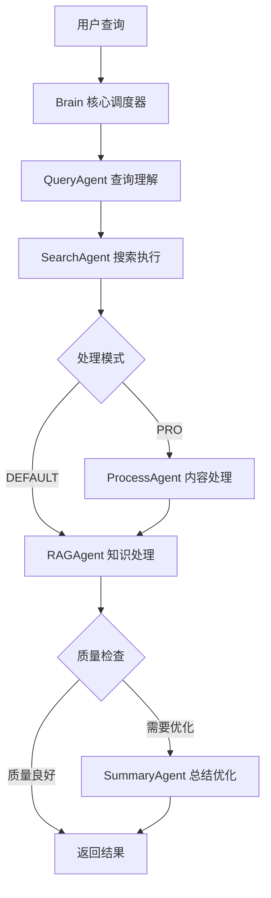

# DeepSearch - 智能搜索与知识汇总系统

[](https://python.org)
[](https://fastapi.tiangolo.com)
[](LICENSE)

基于多Agent架构和RAG (Retrieval-Augmented Generation) 技术构建的智能搜索结果汇总系统。通过多个专业化Agent协作，实现从搜索到总结的全流程自动化处理。

## ✨ 核心特性

- 🤖 **多Agent协作架构** - 专业化分工，高效协作
- 🔍 **多搜索引擎支持** - Google、Bing、Serper、SerpAPI
- 🧠 **RAG知识增强** - 基于向量数据库的智能检索
- 📝 **智能内容总结** - 自动提取关键信息并生成摘要
- 🚀 **双模式处理** - 快速模式(DEFAULT) 和 深度模式(PRO)
- 🌐 **中文优化** - 针对中文内容优化的处理流程
- 📊 **质量评估** - 自动评估结果质量并迭代优化
- 🔄 **流式处理** - 支持实时进度反馈

## 🏗️ 系统架构

### 核心处理流程



### Agent 系统架构

#### 🧠 Brain (核心调度器)
- **职责**: 整体流程控制、质量评估、迭代管理
- **功能**:
  - 多模式处理 (DEFAULT/PRO)
  - 质量评估与迭代优化
  - 进度管理与错误处理
  - WebSocket 实时通信

#### 🔍 QueryAgent (查询理解)
- **职责**: 查询优化与理解
- **功能**:
  - 使用 Gemini API 优化查询
  - 提取关键词和意图
  - 生成更精准的搜索词

#### 🌐 SearchAgent (搜索执行)
- **职责**: 多引擎搜索与结果整合
- **功能**:
  - 支持 Google、Bing、Serper、SerpAPI
  - 结果去重与排序
  - 搜索结果过滤

#### 📄 ProcessAgent (内容处理) - PRO模式专用
- **职责**: 完整网页内容抓取与处理
- **功能**:
  - 网页内容抓取
  - HTML 解析与清理
  - 文本提取与预处理

#### 🧠 RAGAgent (知识增强)
- **职责**: 向量化处理与知识检索
- **功能**:
  - 文本向量化 (Gemini Embedding)
  - ChromaDB 向量存储
  - 相似度搜索与排序
  - 知识摘要生成

#### 📝 SummaryAgent (总结优化) - 可选
- **职责**: 最终总结优化与完善
- **功能**:
  - 基于 RAG 摘要进行优化
  - 确保回答准确性和完整性
  - 格式化输出

## 🚀 处理模式

### DEFAULT 模式 (快速处理)

**适用场景**: 快速获取基本信息，响应时间优先

**处理流程**:
1. **查询理解** - 优化搜索查询
2. **搜索执行** - 获取搜索结果
3. **RAG处理** - 基于搜索结果snippet进行向量化和总结
4. **质量检查** - 自动评估结果质量

**特点**:
- ⚡ 处理速度快 (通常 10-20 秒)
- 📊 基于搜索结果摘要
- 🎯 适合简单查询

### PRO 模式 (深度分析)

**适用场景**: 需要深度分析和完整信息的复杂查询

**处理流程**:
1. **查询理解** - 优化搜索查询
2. **搜索执行** - 获取搜索结果
3. **内容处理** - 抓取完整网页内容
4. **RAG处理** - 基于完整内容进行深度分析
5. **质量检查** - 更严格的质量评估
6. **总结优化** - 可选的进一步优化

**特点**:
- 🔍 深度内容分析 (通常 30-60 秒)
- 📄 基于完整网页内容
- 🎯 适合复杂查询和研究需求
- 📊 更严格的质量标准

## 🛠️ 技术栈

### 核心框架
- **FastAPI** - 高性能 Web 框架
- **Pydantic** - 数据验证和序列化
- **AsyncIO** - 异步编程支持

### AI & ML
- **Google Gemini** - LLM 和 Embedding 模型
- **ChromaDB** - 向量数据库
- **RAG** - 检索增强生成

### 搜索引擎
- **Google Custom Search API**
- **Bing Search API**
- **Serper API**
- **SerpAPI**

### 数据处理
- **BeautifulSoup4** - HTML 解析
- **aiohttp** - 异步 HTTP 客户端
- **Requests** - HTTP 请求库

### 开发工具
- **Uvicorn** - ASGI 服务器
- **Python-dotenv** - 环境变量管理
- **Logging** - 日志系统

## 📦 项目结构

```
deepsearch/
├── app/
│   ├── main.py              # FastAPI 应用入口
│   ├── config.py            # 配置管理
│   ├── brain.py             # 核心调度器
│   ├── agents/              # Agent 实现
│   │   ├── query_agent.py   # 查询理解
│   │   ├── search_agent.py  # 搜索执行
│   │   ├── process_agent.py # 内容处理 (PRO)
│   │   ├── rag_agent.py     # RAG 处理
│   │   └── summary_agent.py # 总结优化
│   ├── models/
│   │   └── schemas.py       # 数据模型
│   ├── services/
│   │   ├── llm/            # LLM 服务
│   │   ├── search.py       # 搜索服务
│   │   ├── vectorstore.py  # 向量存储
│   │   └── websocket.py    # WebSocket 通信
│   └── utils/
│       └── logger.py       # 日志系统
├── requirements.txt         # 项目依赖
├── .env.example            # 环境变量模板
└── README.md               # 项目文档
```

## 🚀 快速开始

### 1. 环境准备

```bash
# 克隆项目
git clone <repository-url>
cd deepsearch

# 创建虚拟环境
python -m venv venv

# 激活虚拟环境
# Windows
.\venv\Scripts\activate
# Linux/Mac
source venv/bin/activate

# 安装依赖
pip install -r requirements.txt
```

### 2. 配置设置

复制环境变量模板并配置：

```bash
cp .env.example .env
```

编辑 `.env` 文件，配置必要的 API 密钥：

```env
# LLM 配置 (必需)
GOOGLE_API_KEY=your_gemini_api_key

# 搜索引擎配置 (至少配置一个)
GOOGLE_CX= 
SERPER_API_KEY=your_serper_api_key
SERPAPI_API_KEY=your_serpapi_key
BING_API_KEY=your_bing_api_key

# 服务配置
HOST=0.0.0.0
PORT=8000
DEBUG=true
```

### 3. 启动服务

#### 方式一：使用启动脚本 (推荐)

```bash
# Linux/Mac
chmod +x start.sh
./start.sh

# Windows
start.bat
```

#### 方式二：手动启动

```bash
# 开发模式
python -m app.main

# 或使用 uvicorn
uvicorn app.main:app --reload --host 0.0.0.0 --port 8000
```

#### 方式三：Docker (可选)

```bash
# 构建镜像
docker build -t deepsearch .

# 运行容器
docker run -p 8000:8000 --env-file .env deepsearch
```

### 4. 访问服务

启动成功后，可以访问：

- **API 服务**: http://localhost:8000
- **API 文档**: http://localhost:8000/docs  
- **健康检查**: http://localhost:8000/api/health

### 5. 测试接口

```bash
# 快速模式测试
curl -X POST "http://localhost:8000/api/search" \
  -H "Content-Type: application/json" \
  -d '{"query": "人工智能的发展历史", "mode": "default"}'

# 深度模式测试
curl -X POST "http://localhost:8000/api/search" \
  -H "Content-Type: application/json" \
  -d '{"query": "量子计算的原理和应用", "mode": "pro"}'
```

## 📚 API 文档

### 主要接口

#### POST `/api/search`

**请求参数**:
```json
{
  "query": "搜索查询内容",
  "mode": "default|pro"
}
```

**响应格式**:
```json
{
  "summary": "智能生成的搜索结果总结",
  "sources": [
    "https://source1.com",
    "https://source2.com"
  ],
  "metadata": {
    "processing_time": 15.2,
    "mode": "default",
    "quality_score": 0.85
  }
}
```

#### WebSocket `/ws/{client_id}`

实时接收处理进度：
```javascript
const ws = new WebSocket('ws://localhost:8000/ws/client123');
ws.onmessage = (event) => {
  const data = JSON.parse(event.data);
  console.log(`进度: ${data.stage} - ${data.progress * 100}%`);
};
```

### 在线文档

启动服务后访问：
- **Swagger UI**: http://localhost:8000/docs
- **ReDoc**: http://localhost:8000/redoc

## ⚙️ 配置说明

### LLM 配置

```python
# config.py
class LLMConfig:
    provider: str = "gemini"  # 目前支持 gemini
    google_api_key: str = ""  # Gemini API 密钥
    gemini_chat_model: str = "gemini-2.5-flash"
    gemini_embedding_model: str = "models/embedding-001"
```

### 搜索引擎配置

支持多个搜索引擎，按优先级使用：
1. **Serper API** (推荐) - 稳定且成本低
2. **SerpAPI** - 功能丰富
3. **Bing Search API** - 微软官方
4. **Google Custom Search** - 需要启用 API

### 向量存储配置

```python
class RAGConfig:
    vector_store_type: str = "chroma"
    vector_store_path: str = "./data/vectorstore"
    collection_name: str = "search_results"
    chunk_size: int = 1000
    top_k: int = 4
```

## 🔧 高级配置

### 质量评估标准

系统会自动评估结果质量，评分标准：

**DEFAULT 模式**:
- 来源数量 ≥ 2 个 (+0.3)
- 总结长度 ≥ 150 字符 (+0.3)
- RAG 相关度 ≥ 0.7 (+0.4)

**PRO 模式**:
- 来源数量 ≥ 3 个 (+0.2)
- 总结长度 ≥ 300 字符 (+0.2)
- RAG 相关度 ≥ 0.8 (+0.2)
- 来源多样性 ≥ 2 个域名 (+0.2)
- 内容处理结果 (+0.2)

### 迭代优化

当质量评分低于阈值时，系统会自动：
1. 切换到 PRO 模式
2. 优化搜索查询
3. 重新处理和评估

## 🐛 故障排除

### 常见问题

1. **API 密钥错误**
   ```
   错误: Invalid API key
   解决: 检查 .env 文件中的 API 密钥配置
   ```

2. **搜索引擎不可用**
   ```
   错误: No valid search API configured
   解决: 至少配置一个有效的搜索引擎 API
   ```

3. **向量存储错误**
   ```
   错误: ChromaDB connection failed
   解决: 检查磁盘空间和权限，删除损坏的数据库文件
   ```

### 日志调试

启用详细日志：
```python
# config.py
DEBUG = True
LOG_LEVEL = "DEBUG"
```

查看日志文件：
```bash
tail -f logs/app.log
```

## 🤝 贡献指南

1. Fork 项目
2. 创建功能分支 (`git checkout -b feature/AmazingFeature`)
3. 提交更改 (`git commit -m 'Add some AmazingFeature'`)
4. 推送到分支 (`git push origin feature/AmazingFeature`)
5. 开启 Pull Request

## 📄 许可证

本项目采用 MIT 许可证 - 查看 [LICENSE](LICENSE) 文件了解详情

## 🙏 致谢

- [FastAPI](https://fastapi.tiangolo.com/) - 现代化的 Web 框架
- [Google Gemini](https://ai.google.dev/) - 强大的 LLM 和 Embedding 模型
- [ChromaDB](https://www.trychroma.com/) - 高效的向量数据库
- [BeautifulSoup](https://www.crummy.com/software/BeautifulSoup/) - HTML 解析库

---

**DeepSearch** - 让搜索更智能，让知识更易得 🚀